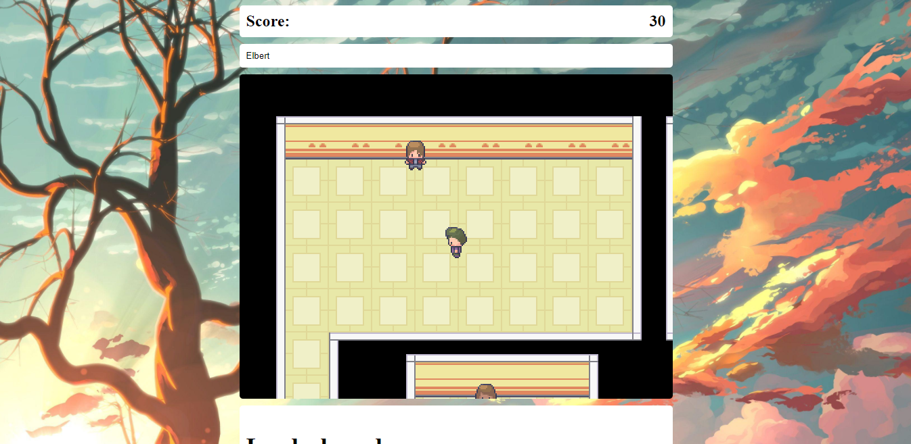

# Rock, Pape, Scissors Js - RPG Game

> A rpg turn based game for Rock, Paper and Scissors. Built with Javascript and the Phaser library.



## Built With

- HTML
- CSS
- Phaser
- JavaScript

## Live Demo

[Live Demo Link](https://raw.githack.com/elberthcorniell/rock-paper-scissor-js/game-creation/dist/index.html)

## Game description

You will be in a big room with 3 guys. The will challenge you to rock, paper, scissors battles.

Every time you start a battle, the first one to win 3 rounds wins. If you loose, is Game Over.

Be careful with last guy, Bob, he is the final boss and he can win just with 2 rounds.

### How to play

- Movement: 
⬆️ move up,
⬇️ move down,
⬅️ move left,
➡️ move right

- Selection:
[ Space bar ]

- Start a battle:
Enemie will start the battle as soon as they see you.

- Start game
[ Enter ]

### How to earn points

- Collecting the Earth globes in the room.
- Wining battles: 
    If you loose 0 rounds you will get 100 points.
    If you loose 1 rounds you will get 66 points.
    If you loose 2 rounds you will get 32 points.

### Leaderboard

- Every time the game is over you will see the top 5 leaderboard (And hopefully you will be there!). 

## Getting Started

To get a local copy up and running follow these simple example steps.

### Prerequisites

- Live Server plugin for Visual Studio Code 

### Setup

1- Clone the repository
```
    git clone https://github.com/elberthcorniell/rock-paper-scissors-js.git
```

2- Open the folder on VS Code. 
```
    cd rock-paper-scissors-js
    code .
```

3- Right click the dist/index.html file and click on "Open With Live Server"

4- Everything should be running by now. 


### JavaScript Build

Run the next on your terminal in the repository folder:

- For development build:
```
    npm run webpack
```

- For production build:
```
    npm run build
```

### Testing

Run the next on your terminal in the repository folder:

```
    npm test
```


## Author

👤 **Elbert Corniell**

- GitHub: [@elberthcorniell](https://github.com/elberthcorniell)
- Twitter: [@elberthcorniell](https://twitter.com/elberthcorniell)
- LinkedIn: [LinkedIn](https://www.linkedin.com/in/elbert-corniell-989183159/)

## Acknowledgments

- [Microverse](https://www.microverse.org/)

## 🤝 Contributing

Contributions, issues, and feature requests are welcome!

Feel free to check the [issues page](https://github.com/elberthcorniell/rock-paper-scissors-js/issues).

## Show your support

Give a ⭐️ if you like this project!


## 📝 License

This project is [MIT](./LICENSE) licensed.
